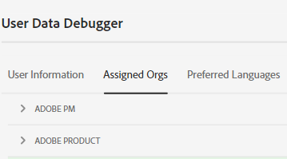

# Organizations and accounts

An *organization* (Org ID) is the entity that enables an administrator to configure groups and users, and to control single sign-on in CX Enterprise. 

The organization functions like a log-in company that spans all CX Enterprise products and applications. Most often, an organization is your company name. However, a company can have many organizations. 

**Organization menu**

To verify that you have logged in to your correct organization, click **[!UICONTROL Profile]** to see the default organization name. If you have access to more than one organization, you can also view and switch to another organization in the header bar.

>[!NOTE]
>
>Switching between organizations lets you access the Admin Console for that specific organization. If you don't see the desired organization listed, you may need to request access from an administrator in that organization. (If you need to merge multiple Admin Consoles, contact Adobe Customer Support for help.)

## Federated IDs

If your organization uses Federated IDs, CX Enterprise allows you to sign in with your organization's single sign-on without being required to enter your email address and password. Add `#/sso:@domain` to the CX Enterprise URL (`https://experience.adobe.com`) to accomplish this task.
    
For example, for an organization with Federated IDs and the domain `example.com`, set your URL link to `https://experience.adobe.com/#/sso:@example.com`. You can also go directly to a specific application by bookmarking this URL, appended with the application path. (For example, for Adobe Analytics, `https://experience.adobe.com/#/sso:@example.com/analytics`.)

## Federated guest accounts

You can enable [federated guest access](https://helpx.adobe.com/business/enterprise/using/federated-guest-access.html) to securely authenticate guest users on your own domain. If enabled, the Organization menu changes to enable those users to switch between accounts within the existing organization on any CX Enterprise page.

To switch to a federated guest account, locate **[!UICONTROL Other Accounts]** in the **[!UICONTROL Organization]** menu on any [CX Enterprise](https://experience.adobe.com) page.

**Organization menu for a federated guest account**

## View your organization ID 

You can locate your assigned organization ID for support purposes. You can verify that you are in the correct organization, or switch between organizations, using the **[!UICONTROL Organization]** selector in the header.

The organization ID is the ID associated with your provisioned CX Enterprise company. This ID is a 24-character alphanumeric string, followed by (and must include) `@AdobeOrg`.

You can view your organization ID, along with other account information, using the keyboard shortcut **Ctrl+i** from any page at `https://experience.adobe.com`.

**To view your organization ID**

1. In [CX Enterprise](https://experience.adobe.com), press **Ctrl+i** on your keyboard.

    

1. Under **[!UICONTROL User Information]**, look for **[!UICONTROL Current Org ID]**, and you can locate the organization ID.

   Alternatively, administrators can log into the Admin Console (Navigate to [https://adminconsole.adobe.com](https://adminconsole.adobe.com)) and view your organization ID in the URL. 

   For example, in the following URL: 

   `https://adminconsole.adobe.com/C538193582390300A495CC9@AdobeOrg/overview` 

   The ID is: 

   `C538193582390300A495CC9@AdobeOrg`

## Specify a default organization 

You can specify a default organization to use when you log in.

1. In the header, click **[!UICONTROL Profile]**, then click Preferences.

1. Under [!UICONTROL General], select a default organization.

 
