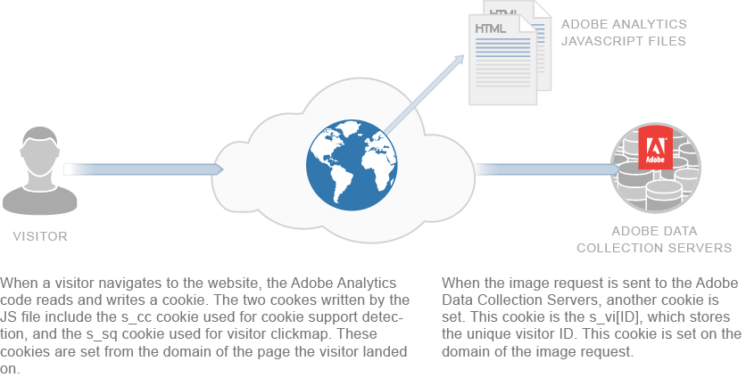

# Cookies used in Experience Cloud

Adobe Experience Cloud uses cookies. A cookie is a small piece of data a website sends to your browser, which stores it for later use. Cookies help the website remember things when you visit again or move between pages. Cookies help track visits and tell one device apart from another.

Laws often require you to get permission before storing or using cookies on someone's device. Adobe recommends checking with your legal team to understand the rules that apply.

## About first-party cookies

Adobe Experience Cloud uses cookies to track information that doesn't last between page views or browser sessions. When possible, Adobe uses first-party cookies (tied to your own website). To track activity across multiple sites or domains you own, third-party cookies are needed.

Some browsers and anti-spyware tools block third-party cookies. Adobe has ways to make sure cookies still work even if cookies are blocked. How this works depends on whether you use the Experience Platform Identity Service (ECID) or older Analytics cookies (like the `s_vi` cookie):

* [Experience Cloud Identity Service](https://experienceleague.adobe.com/en/docs/id-service/using/intro/overview): The ECID Service always sets first-party cookies, whether your collection domain matches your site domain. It uses JavaScript to place the cookie on your site's domain.

* [Analytics legacy identifiers](analytics.md) (such as the `s_vi` cookie): Whether cookies are first- or third-party depends on your setup:

  * If your data collection server matches your site's domain, cookies are first-party.
  * If it doesn't match, cookies are third-party. If third-party cookies are blocked, Adobe sets a fallback cookie (`s_fid`) instead of the usual one.

To ensure that your collection server matches your site's domain, you can use a **CNAME setup**. This involves updating your DNS settings to point a custom domain (you own) to Adobe's servers. This makes the tracking cookie appear as first-party. While one CNAME can work across multiple domains, any domain that doesn't match the CNAME will still set third-party cookies.

>[!NOTE]
>
>Apple's Intelligent Tracking Prevention (ITP) limits how long Adobe's first-party cookies last, even if your collection domain matches your site domain. ITP affects Safari on macOS and all browsers on iOS and iPadOS. Since November 2020, cookies set using CNAME expire just as quickly as cookies set with JavaScript. This time limit may change in the future.

Here's a simplified version of the text:

## Cookies and privacy

Adobe takes privacy and data security seriously. It works with privacy organizations, regulators, and programs like AdChoices to give people control over how their data is used.

Most cookies from Adobe Experience Cloud don't store personal information. They're secure and only used by your company--for reporting, content, and advertising. Adobe doesn't share this data with other customers or third parties, except in anonymous, industry-wide reports (like Digital Marketing Insight Reports).

Adobe doesn't combine browser data across different companies. To protect privacy, some Adobe tools let each website use its own set of cookies. Some also allow using your own domain for cookies, making them first-party and more secure.

Cookies can only store information that was saved in them earlier. They can't run code or read other data on your device. Also, web browsers only allow cookies to be read by the website that set them. For example, only Adobe.com can read cookies it sets.

The following diagram illustrates cookie usage for a standard image request: 

The following diagram illustrates cookie usage for a straight image request (used in scenarios where a JS file is not loaded): 

