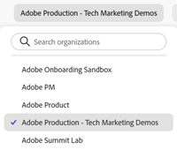
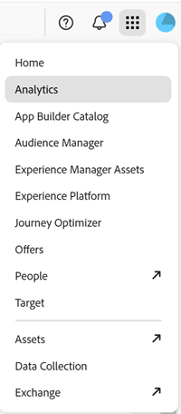
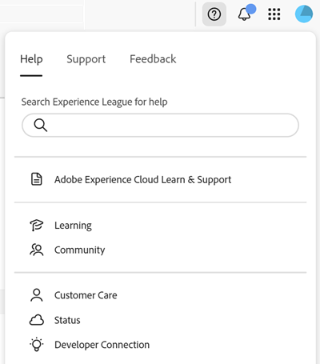
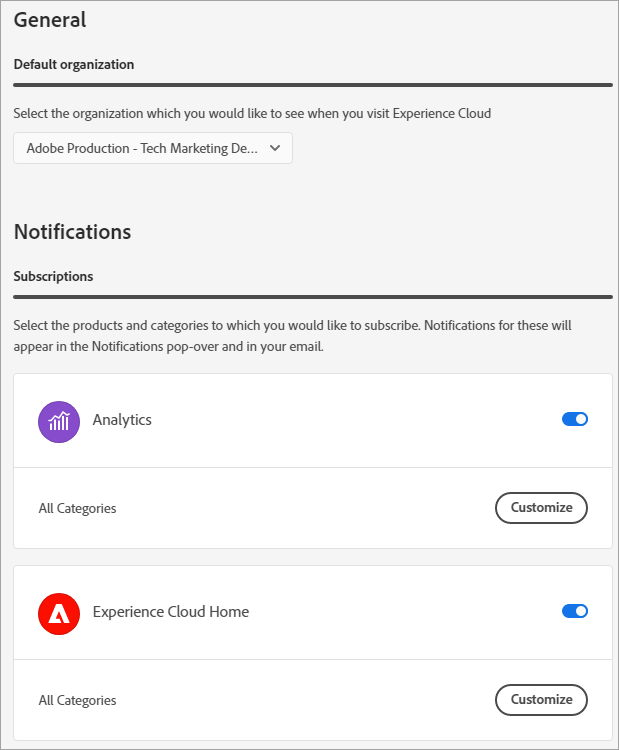
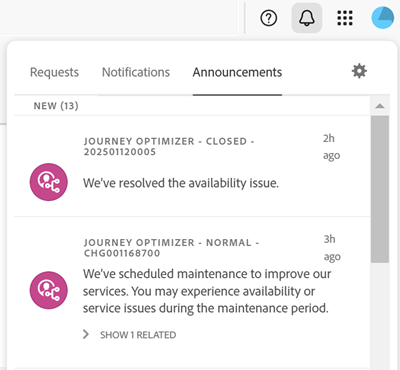

# CX Enterprise central interface components

CX Enterprise's central interface components include features that enable you to:

* Sign in and access your applications and services
* Find product help and business objects using a global search
* Manage your account preferences (alerts, notifications, and subscriptions)

## Browser support in CX Enterprise 

For the best performance, CX Enterprise is optimized for the most popular browsers, including the latest version, plus the two previous versions.

* Chrome
* Edge
* Firefox
* Opera
* Safari

If your browser is not listed, it may still be supported, but it is recommended that you use one of the listed browsers. 

>[!NOTE]
>
>Not all applications running on CX Enterprise domain support all browsers. If you're unsure, check the documentation of a specific application.

## Language support in CX Enterprise 

CX Enterprise supports preferred languages for each user, as set in your Adobe user account preferences. Supported languages currently are: 

* Chinese
* English
* French
* German
* Italian
* Japanese
* Korean
* Portuguese
* Spanish
* Taiwanese

While all application team are committed to global language support, not all applications are offered in all languages noted above. If your primary language is not supported in a CX Enterprise application, you can also set a secondary language to default to when applicable. This can be done in [CX Enterprise user preferences](https://experience.adobe.com/preferences).

## Sign in to CX Enterprise 

Sign in and verify that you are in the right organization.

1. Navigate to [Adobe CX Enterprise](https://experience.adobe.com).
1. Click **[!UICONTROL Sign in with an Adobe ID]**.
1. Verify that you are in the right organization.

    

    To verify that you have logged in to your correct organization, click **[!UICONTROL Profile]** to see organization name. If you have access to more than one organization, you can also view and switch to another organization using the **[!UICONTROL Organization]** selector. 

    If your organization uses Federated IDs, CX Enterprise allows you to sign in with your organization's single sign-on without being required to enter your email address and password. Add `#/sso:@domain` to the CX Enterprise URL (`https://experience.adobe.com`) to accomplish this task.
    
    For example, for an organization with Federated IDs and the domain `example.com`, set your URL link to `https://experience.adobe.com/#/sso:@example.com`. You can also go directly to a specific application by bookmarking this URL, appended with the application path. (For example, for Adobe Analytics, `https://experience.adobe.com/#/sso:@example.com/analytics`.)

## Access CX Enterprise applications 

After signing in to CX Enterprise, you can quickly access all your applications, services, and organizations from the unified header.

Click the application selector  to access CX Enterprise services that you own.

## Search and support in CX Enterprise 

CX Enterprise search allows you to search for help (documentation, tutorials, and courses) on [Experience League](https://experienceleague.adobe.com/#home). 

 

The [!UICONTROL Help] menu also gives you access to:

* **[!UICONTROL Support]:** Create a support ticket or contact [!UICONTROL Support] using Twitter.
* **[!UICONTROL Feedback]:** Contact Adobe using Feedback and let us know what you think.
* **[!UICONTROL Status]:** Navigate to `https://status.adobe.com/experience_cloud` and check product operational status and [!UICONTROL Manage Subscriptions].
* **[!UICONTROL Developer Connection]:** Navigation to `adobe.io` and find developer documentation.

## Account preferences 

In the account preferences menu, you can:

* Specify a dark theme (not all applications support this theme)
* Search for Organizations
* Sign out
* Configure account [preferences, notifications, and subscriptions](#preferences)

### Manage CX Enterprise [!UICONTROL Preferences] 

CX Enterprise preferences include notifications, subscriptions, and alerts. 

* Click **[!UICONTROL Preferences]** from your account menu  to manage preferences.

On [!UICONTROL CX Enterprise preferences], you can configure the following features:

| Feature | Description |
| --- | --- |
|Default organization |Select the organization that you want to see when you launch CX Enterprise. |
|[!UICONTROL Subscriptions]|Select the products and categories to which you would like to subscribe. Notifications in the [!UICONTROL Notifications] pop-over and in your email.|
|[!UICONTROL Priority]|Select the categories that you want to be considered high priority. These categories are marked with a High tag and can be configured for delivery like alerts.|
|[!UICONTROL Alerts]|Select the notifications for which you would like to see alerts displayed in your browser. Alerts appear in the top-right corner of your window for a few seconds.|
|Emails|Specify the frequency at which you would like to receive notification emails. (Not sent, instant, daily, or weekly.)|

{style="table-layout:auto"}

## Notifications and Announcements 

Click **[!UICONTROL Notifications]** to see notifications that are important to you, and announcements from Adobe.

You can configure notifications in [CX Enterprise preferences](#preferences).
