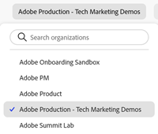

# Experience Cloud central interface overview

[Experience Cloud](https://experience.adobe.com) is Adobe's integrated family of digital marketing applications, products, and services. From its intuitive interface, you can quickly access your cloud applications, product features, and services.

From Experience Cloud's header, you can:

* Access your applications and services
* From the Help menu, search for product documentation, tutorials, and community posts. View results in Experience League.
* Globally search business objects using a global search (Experience Platform users only) in the Search field.
* Manage your account preferences (alerts, notifications, and subscriptions)

## Sign in to Experience Cloud {#signin}

Sign in and verify that you are in the right [organization](administration/organizations.md).

1. Navigate to [Adobe Experience Cloud](https://experience.adobe.com).
1. Type your Adobe email address, then select **[!UICONTROL Continue]**.
    
    Administrators, see [Experience Cloud user authentication](admin-getting-started.md#migration) for important updates to identity types (Business ID).

1. Select an account. 
1. Type your password.
1. Verify that you are in the right organization.

    

    **Verify your organization**

    To verify that you have logged in to your correct [organization](administration/organizations.md), click on your profile avatar to see organization name. If you have access to more than one organization, you can also view and switch to another organization right in the header bar. 

    If your organization uses Federated IDs, Experience Cloud allows you to sign in with your organization's single sign-on without being required to enter your email address and password. Add `#/sso:@domain` to the Experience Cloud URL (`https://experience.adobe.com`) to accomplish this task.
    
    For example, for an organization with Federated IDs and the domain `adobecustomer.com`, set your URL link to `https://experience.adobe.com/#/sso:@adobecustomer.com`. You can also go directly to a specific application by bookmarking this URL, appended with the application path. (For example, for Adobe Analytics, `https://experience.adobe.com/#/sso:@adobecustomer.com/analytics`.)

## Access Experience Cloud applications {#navigation}

After signing in to Experience Cloud, you can quickly access all your applications, services, and organizations from the unified header.

To access Experience Cloud applications and services provisioned for you within your organization, go the application selector .

## Get help and support {#support}

Access learning and help using the Help icon () in the header, including help content (documentation, tutorials, and courses) on [Experience League](https://experienceleague.adobe.com/#home), as well as additional resources for individual applications. You can also submit open-ended feedback and create prioritized support tickets.

The [!UICONTROL Help] menu also gives you access to:

* **[!UICONTROL Support]:** Create a support ticket or contact [!UICONTROL Support] using Twitter.
* **[!UICONTROL Feedback]:** Share feedback about your Experience Cloud experience. Your feedback is used to improve Adobe's products and services.
* **[!UICONTROL Status]:** Navigate to `https://status.adobe.com/experience_cloud` and check product operational status and [!UICONTROL Manage Subscriptions].
* **[!UICONTROL Developer Connection]:** Navigation to `adobe.io` and find developer documentation.

## User profile and account preferences {#preferences}

Experience Cloud preferences include notifications, subscriptions, and alerts. In the account preferences menu, you can:

* Specify a dark theme (not all applications support this theme)
* Search for [Organizations](administration/organizations.md)
* Sign out
* Configure account preferences, notifications, and subscriptions

To manage preferences, select **[!UICONTROL Preferences]** from your account menu .

On [!UICONTROL Experience Cloud preferences], you can configure the following features:

| Feature | Description |
|--- |--- |
|Default [organization](administration/organizations.md)|Select the organization that you want to see when you launch Experience Cloud. |
|[!UICONTROL Product data collection]|Select which technologies Adobe can use to collect data on how you use your Adobe products. |
|[!UICONTROL Personalized learning recommendations and promotions]|Select where you would like to receive personalized help for your Adobe product(s). This help is available via email, in-product, and the Experience League Communities. [Learn more.](features/personalized-learning.md) |
|[!UICONTROL Subscriptions]|Select the products and categories to which you would like to subscribe. Notifications in the [!UICONTROL Notifications] pop-over and in your email.|
|[!UICONTROL Priority]|Select the categories that you want to be considered high priority. These categories are marked with a High tag and can be configured for delivery like alerts.|
|[!UICONTROL Alerts]|Select the notifications for which you would like to see alerts displayed in your browser. Alerts appear in the top-right corner of your window for a few seconds.|
|Emails|Specify the frequency at which you would like to receive notification emails. (Not sent, instant, daily, or weekly.)|

{style="table-layout:auto"}

## Notifications and Announcements {#notifications}

Select **[!UICONTROL Notifications]** to be alerted about relevant and actionable updates, including product releases, maintenance notices, shared items, and approval requests.

