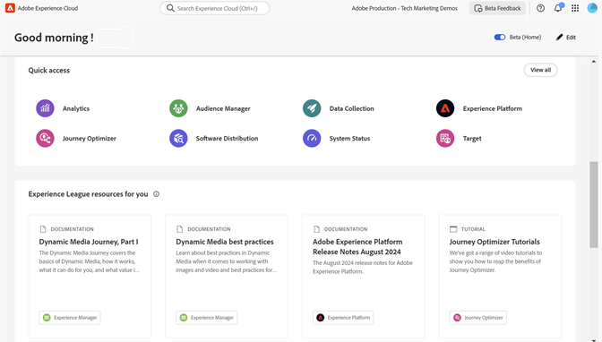

# Experience Cloud Interface and Administration Guide

[Experience Cloud](https://experience.adobe.com) is Adobe's integrated family of digital marketing applications, products, and services. From its intuitive interface, you can quickly access your cloud applications, product features, and services.

<!--  -->

From the Experience cloud central interface, you can:

* Access your applications and services
* Use the Help menu to search for product documentation, tutorials, and community posts. View results in Experience League.
* Globally search business objects using a global search (Experience Platform users only) in the Search field.
* Manage your account [preferences](#user-profile-and-account-preferences) (alerts, notifications, and subscriptions)
* Access [!DNL People] service ([!DNL Customer Attributes], [!DNL Audience Library])

## What's new

* **Help search:** In the [!DNL Experience Cloud] **[!UICONTROL Help]** menu, the content search has been updated to filter by application in the [Experience League](https://experienceleague.adobe.com/#home) search results.

* **Provisioning update:** See [Provisioning update notice](admin-getting-started.md#provisioning) for important updates to provisioning in Experience Cloud.

## Start with the basics

[adopt these for Cust Attrs, Audiences, Assets, etc.]

<table style="table-layout:fixed">
  <tr style="border: 0;">
    <td>
    </a>
    
<strong>Quick start guides</strong> Learn how to achieve your goals faster in Journey Optimizer with your personalized approach depending on your role.

    </td>
    <td>
    
    
<strong>User interface</strong> Learn how to navigate Experience Cloud, launch applications, and search for help.
 
    </td>
    <td>
    
    
<strong>Create your first journey</strong> Design and orchestrate personalized omnichannel journeys to harmonize marketing outreach with one-to-one customer engagement. 
    
</td>
    <td>
    
    
<strong>Launch your first campaign</strong> Create and start your first campaign in Journey Optimizer to deliver targeted, one-time content to a specific audience.

    </td>
  </tr>
</table>

## Get help on administration and cross-application services

This guide provides access to help on Experience Cloud user and product administration in the Admin Console, enabling applications for platform services. You can also access help on the Audience Library, Customer Attributes, Experience Cloud Assets, and more:

* [[!UICONTROL Audience Library]](audience-library.md)
* [[!UICONTROL Customer Attributes]](attributes.md)
* [[!UICONTROL Triggers]](triggers.md)
* [Experience Cloud [!UICONTROL Assets]](experience-cloud-assets.md)
* [Experience Cloud cookies](cookies-privacy.md)
* [User and product management](admin-getting-started.md) (Admin Console)
* [Enable your applications for core services](core-services.md)
* [Frequently asked questions](admin-getting-started.md)
* [Organizations and account linking](organizations.md)
* [Integrations](marketing-cloud-integrations.md)
* [Integrating Adobe Target with the Experience Cloud](https://experienceleague.adobe.com/docs/target/using/integrate/a4t/a4t.html?lang=en)
* [Experience Cloud privacy and security overview](assets/Adobe-Marketing-Cloud-Privacy-and-Security-Overview.pdf)
* [DNS prefetch](admin-getting-started.md#concept_6BC8C6856E3644F8956D7AD0A96383B7)

## Guides

Related Experience Cloud guides include:

* [Adobe Mobile](https://experienceleague.adobe.com/docs/mobile-services/using/home.html?lang=en)
* [Experience Platform Co-op Graph](https://experienceleague.adobe.com/docs/device-co-op/using/home.html?lang=en)
* [Exchange](https://exchange.adobe.com/experiencecloud)
* [Experience Cloud ID Service](https://experienceleague.adobe.com/docs/id-service/using/home.html?lang=en)
* [Experience Platform Data Collection/Launch](https://experienceleague.adobe.com/docs/launch.html?lang=en)
* [Experience Cloud Debugger](https://experienceleague.adobe.com/docs/debugger/using/experience-cloud-debugger.html?lang=en)
* [[!UICONTROL Dynamic Tag Management]](https://experienceleague.adobe.com/docs/experience-platform/tags/home.html?lang=en)

## Tutorials

Take advantage of self-help tutorials and quick how-tos in Experience League:

* [All tutorials in Experience League](https://experienceleague.adobe.com/?lang=en#quick-how-tos)
* [Experience Platform tutorials](https://experienceleague.adobe.com/docs/platform-learn/data-collection/overview.html?lang=en)
* [Real-time Customer Data Platform](https://experienceleague.adobe.com/docs/platform-learn/tutorials/application-services/rtcdp/understanding-the-real-time-customer-data-platform.html?lang=en)

## Release notes and related Experience Cloud help

* [Product documentation for all Experience Cloud applications](https://experienceleague.adobe.com/docs/home.html?lang=en) - Browse for help at Experience Cloud Learn & Support
* [Release notes and product updates](https://experienceleague.adobe.com/docs/release-notes/experience-cloud/current.html?lang=en) - What's new in the Experience Cloud, and subscribe to get updates
* [Tutorials for implementing core services](https://experienceleague.adobe.com/docs/platform-learn/data-collection/overview.html?lang=en) - Explore videos and tutorials about core services
* [Expert help at Experience League](https://experienceleague.adobe.com/) - Get guided learning from experts and the community
* [Education and training](https://helpx.adobe.com/learning.html?promoid=KAUDK) - Engage with Adobe to ensure that you get the most out of Adobe's products
* [Customer Experience Blog](https://blog.adobe.com/en/topics/digital-transformation) - Read the Experience Cloud blog
* [Customer Care](https://experienceleague.adobe.com/?support-solution=General#support) - Contact Adobe Customer Care

## What's new

Get a glimpse of the newest enhancements in Journey Optimizer product and documentation! For a comprehensive list of features, improvements, and fixes, check out the detailed [Release Notes](using/rn/release-notes.md).  Stay up-to-date with the latest changes in our documentation by visiting the [documentation updates page](using/rn/documentation-updates.md).

>[!BEGINTABS]

>[!TAB Sandbox tooling]

Sandbox tooling allows you to copy objects across multiple sandboxes by leveraging package export and import. A package can consist of a single object or multiple objects. Any objects that are included in a package must be from the same sandbox.

>[!TAB Multimedia Message Service (MMS) in SMS] 

With the SMS Channel, you can now enhance your communication by sending Multimedia Message Service (MMS) messages, enabling the sharing of images, GIFs, or videos with your customers. Note that this feature is currently available with Sinch only.

>[!ENDTABS]

## Start with the basics

<table style="table-layout:fixed">
  <tr style="border: 0;">
    <td>
    </a>
    
<strong>Quick start guides</strong> Learn how to achieve your goals faster in Journey Optimizer with your personalized approach depending on your role.

    </td>
    <td>
    
    
<strong>User interface</strong> Learn how to navigate and optimize your experience in Journey Optimizer.
 
    </td>
    <td>
    
    
<strong>Create your first journey</strong> Design and orchestrate personalized omnichannel journeys to harmonize marketing outreach with one-to-one customer engagement. 
    
</td>
    <td>
    
    
<strong>Launch your first campaign</strong> Create and start your first campaign in Journey Optimizer to deliver targeted, one-time content to a specific audience.

    </td>
  </tr>
</table>

## Explore the documentation

<table style="table-layout:auto">
  <tr style="border: 0;">
    <td>
      
    <td>
      <strong>Customer's experience</strong> <a href="using/building-journeys/journey.md">Journeys</a> - <a href="using/campaigns/get-started-with-campaigns.md">Campaigns</a> - <a href="using/landing-pages/get-started-lp.md">Landing pages</a> - <a href="using/reports/live-report.md">Reporting</a> - <a href="using/offers/get-started/starting-offer-decisioning.md">Decision management</a>
    </td>
    <td>
      
    </td>
    <td>
      <strong>Configuration & administration</strong> <a href="using/configuration/channel-surfaces.md">Channel surfaces</a> - <a href="using/configuration/about-data-sources-events-actions.md">Configure journeys</a>  - <a href="using/administration/permissions-overview.md">Access control</a> - <a href="using/administration/sandboxes.md">Sandboxes management</a>
    </td>
    <td>
      
    </td>
    <td>
      <strong>Communication channels</strong> <a href="using/email/get-started-email.md">Email</a> - <a href="using/sms/get-started-sms.md">SMS</a> - <a href="using/in-app/get-started-in-app.md">In-app</a> - <a href="using/push/get-started-push.md">Push notifications</a> - <a href="using/direct-mail/get-started-direct-mail.md">Direct mail</a> - <a href="using/web/get-started-web.md">Web</a>
    </td>
  </tr>
  <tr style="border: 0;">
    <td>
      
    </td>
    <td>
      <strong>Content management</strong> <a href="using/content-management/assets-essentials.md">Assets/images</a> - <a href="using/personalization/personalize.md">Personalization</a> - <a href="using/content-management/content-templates.md">Reusable</a> & <a href="using/personalization/dynamic-content.md">dynamic</a> content - <a href="using/content-management/preview-test.md">Test & preview content</a>
    </td>
    <td>
      
    </td>
    <td>
      <strong>Profiles & audiences</strong> <a href="using/audience/about-audiences.md">Audiences</a> - <a href="using/audience/get-started-profiles.md">Profiles</a> - <a href="using/audience/get-started-identity.md">Identities</a> - <a href="using/audience/license-usage.md">License usage</a> - <a href="using/privacy/get-started-privacy.md">Privacy management</a>
    </td>
    <td>
      
    </td>
    <td>
      <strong>Data management</strong> <a href="using/data/get-started-schemas.md">Schemas</a> - <a href="using/data/get-started-datasets.md">Datasets</a> - <a href="using/data/get-started-queries.md">Queries</a>
    </td>
  </tr>
</table> 

## Additional resources

<table style="table-layout:fixed"><tr style="border: 0;">
<td><strong>Adobe Journey Optimizer</strong> 
<a href="https://experienceleague.adobe.com/docs/journey-optimizer-learn/tutorials/overview.html?lang=en" target="_blank">Tutorials</a> - <a href="https://helpx.adobe.com/legal/product-descriptions/adobe-journey-optimizer.html" target="_blank">Product description</a> - <a href="https://www.adobe.com/content/dam/cc/en/security/pdfs/AJO_SecurityOverview.pdf" target="_blank">Security overview (PDF)</a> - <a href="https://developer.adobe.com/journey-optimizer-apis/" target="_blank">APIs reference</a>
</td>
<td><strong>Adobe Experience Platform</strong> 
<a href="https://experienceleague.adobe.com/docs/experience-platform/landing/home.html" target="_blank">Documentation</a> - <a href="https://www.adobe.com/experience-platform/documentation-and-developer-resources.html" target="_blank">Developers resources</a>
</td>
</tr></table>

<table style="table-layout:auto"><tr style="border: 0;"><td></td><td>
<b>Stay informed and elevate your Adobe Journey Optimizer experience!</b> Sign up for our quarterly newsletter. Gain exclusive access to the latest product updates, captivating stories, real-world use cases, valuable tips, and more – all delivered directly to your inbox every quarter. <a href="https://www.adobe.com/subscription/Adobe_Journey_Optimizer_NL.html">Sign up today!</a></td></tr></table>