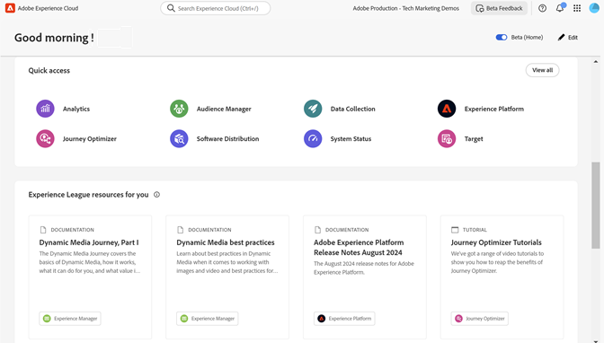

# CX Enterprise interface and administration

[CX Enterprise](https://experience.adobe.com) is Adobe's integrated family of digital marketing applications, products, and services. From its intuitive interface, you can quickly access your cloud applications, product features, and services.

October 30 Hidden

From CX Enterprise's header, you can:

* Access all your CX Enterprise applications and services
* From the Help menu, search for product documentation, tutorials, and community posts. View results in Experience League.
* Globally search business objects using a global search (Experience Platform users only) in the Search field.
* Manage your account [preferences](features/account-preferences.md) (alerts, notifications, and subscriptions)

## Sign in to CX Enterprise {#signin}

Sign in and verify that you are in the right [organization](administration/organizations.md).

1. Navigate to [Adobe CX Enterprise](https://experience.adobe.com).
1. Type your Adobe email address, then click **[!UICONTROL Continue]**.
1. Click an account. 
1. Type your password.
1. Verify that you are in the right organization.

   

   **Verify your organization**

   The [organization](administration/organizations.md) is displayed in the interface header.

   If your organization uses Federated IDs, CX Enterprise allows you to sign in with your organization's single sign-on without being required to enter your email address and password. Add `#/sso:@domain` to the CX Enterprise URL (`https://experience.adobe.com`) to accomplish this task.
    
   For example, for an organization with Federated IDs and the domain `example.com`, set your URL link to `https://experience.adobe.com/#/sso:@example.com`. You can also go directly to a specific application by bookmarking this URL, appended with the application path. (For example, for Adobe Analytics, `https://experience.adobe.com/#/sso:@example.com/analytics`.)

## Access CX Enterprise applications {#navigation}

After signing in to CX Enterprise, you can quickly access all your applications, services, and organizations from the unified header.

To access CX Enterprise applications and services provisioned for you within your organization, go the application selector .

## Get help and support {#support}

Access learning and help using the **[!UICONTROL Help center]** () in the header, including help content (documentation, tutorials, and courses) on [Experience League](https://experienceleague.adobe.com/#home), as well as additional resources for individual applications. You can also submit open-ended feedback and create prioritized support tickets.

The [!UICONTROL Help] menu also gives you access to:

* **[!UICONTROL Support]:** Create a support ticket or contact [!UICONTROL Support] using Twitter.
* **[!UICONTROL Feedback]:** Share feedback about your CX Enterprise experience. Your feedback is used to improve Adobe's products and services.
* **[!UICONTROL Status]:** Navigate to `https://status.adobe.com/experience_cloud` and check product operational status and [!UICONTROL Manage Subscriptions].
* **[!UICONTROL Developer Connection]:** Navigation to `adobe.io` and find developer documentation.

## Manage your user profile

In the [!UICONTROL Profile] menu, you can:

* Specify a dark theme (not all applications support this theme)
* Manage CX Enterprise [Preferences](features/account-preferences.md)
* Select or search for an [Organization](administration/organizations.md)
* View [!UICONTROL Legal Notices]
* Sign out
* Configure account preferences, notifications, and subscriptions

## View in-product notifications and announcements {#notifications}

Click the bell icon to view notifications and announcements. Announcements can be relevant and actionable updates, including product releases, maintenance notices, shared items, and approval requests.

To manage notifications and alerts, see [Account preferences and notifications](features/account-preferences.md)
