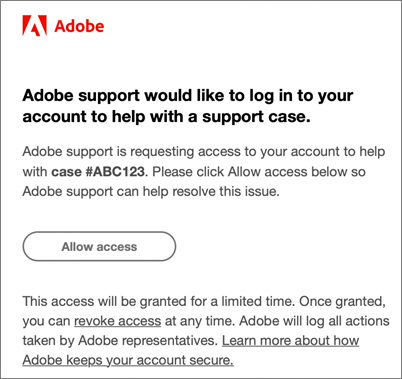

# Frequently asked questions about CX Enterprise

Learn about browser support and common questions and answers for administrators in CX Enterprise.

+++What browsers are supported in CX Enterprise?

Adobe supports the current and previous two versions of the following browsers:

* Microsoft&reg; Edge
* Google Chrome
* Mozilla Firefox
* Safari
* Opera

Use of another browser is possible, but support is not guaranteed. 

>[!NOTE]
>
>Not all applications running on CX Enterprise domain support all browsers. If you're unsure, check the documentation of a specific application.

+++

+++What languages are supported?

CX Enterprise supports preferred languages for each user, as set in your Adobe user account preferences. Supported languages currently are: 

* Chinese
* English
* French
* German
* Italian
* Japanese
* Korean
* Portuguese
* Spanish
* Taiwanese

While application teams are committed to global language support, not all applications are offered in all languages noted above. If your primary language is not supported in a CX Enterprise application, you can also set a secondary language to default to when applicable. This can be done in [CX Enterprise user preferences](https://experience.adobe.com/preferences).

+++

+++Does Adobe charge my company for Adobe CX Enterprise access?

No. Adobe CX Enterprise is included at no additional charge. However, certain core services might have additional costs.

+++

+++Why must my company sign in through the CX Enterprise interface?

The functionality provided by the CX Enterprise interface adds new value to your business. It also is the standard path for accessing applications going forward, eventually replacing other individual application login flows. Logging in through CX Enterprise facilitates a smoother transition later.

+++

+++How can Adobe access my Adobe cloud environment to troubleshoot an issue?

Adobe Customer Care can submit an impersonation request for which you receive an Adobe-branded email (example below) seeking your explicit authorization. The access is granted for a limited time. Once granted, the access can be revoked by you at any time. Adobe logs all actions taken by Adobe representatives.

+++

+++What is "provisioning"?

Provisioning in CX Enterprise means:

* Your users can begin logging in to the CX Enterprise and linking applications.
* They can begin to use the features available through CX Enterprise.
* You can become prepared to retire your application-specific login process.
* You can retain access control to applications.

+++

+++How do I manage user preferences, notifications, and alerts?

* See [Account preferences and notifications](/help/interface/features/account-preferences.md) 

+++

+++How do I manage product profiles and user account credentials?

* See the [Admin Console User Guide](https://helpx.adobe.com/enterprise/admin-guide.html) for help.

* User entitlements and product management are performed in the [Adobe Admin Console](https://adminconsole.adobe.com/enterprise) (product link).

* **Important:** Analytics administrators, see [Manage Analytics Users in the Admin Console](https://experienceleague.adobe.com/docs/analytics/admin/user-product-management/migrate-users/c-migration-tool.html) about migrating user IDs from Analytics Admin Tools to the Admin Console.

+++

+++What can I do if someone cannot log in to CX Enterprise?

Admin Console administrators can grant access to users. Users are sent emails with sign-in instructions. 

You might have to [Contact Adobe Support](https://experienceleague.adobe.com/?support-solution=General#support) to verify that your company has been fully provisioned.

+++

+++Where can a user go to manage account linking?

Some users might be required to link their application (Analytics) account to the Adobe ID or Enterprise ID. 

See [Link an application account to an Adobe ID](../administration/organizations.md). 

+++

+++How do I manage user account profiles and organizations?

See [Manage user accounts](../administration/organizations.md). 

+++

+++What is an organization?

An [organization](../administration/organizations.md) is the entity that enables an administrator to configure groups and users, and to control single sign-on in CX Enterprise. The organization functions like a log-in company that spans all CX Enterprise products and applications. Most often, an organization is your company name. However, a company can have many organizations. 

+++

+++Where can I find my IMS organization ID?

See [View your organization ID](../administration/organizations.md) for details.

+++

+++What should I do when one of my users leaves my company?

Their access should be removed from the application itself. They will not be able to access the product from CX Enterprise or through the direct login. You should also remove them at the CX Enterprise level.

+++

+++What is an Adobe ID?

See [Identity Types](https://helpx.adobe.com/enterprise/using/identity.html).

+++

+++Can I link application accounts for my users?

No. Users must link their own applications with their user names and passwords.

+++

