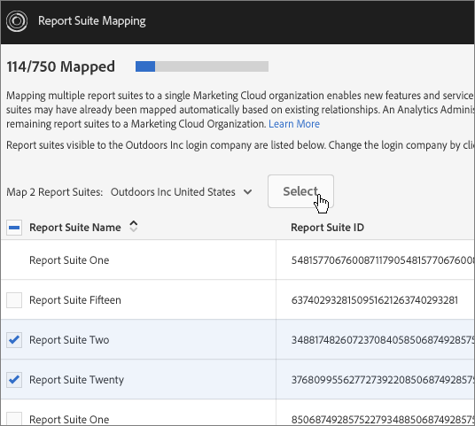
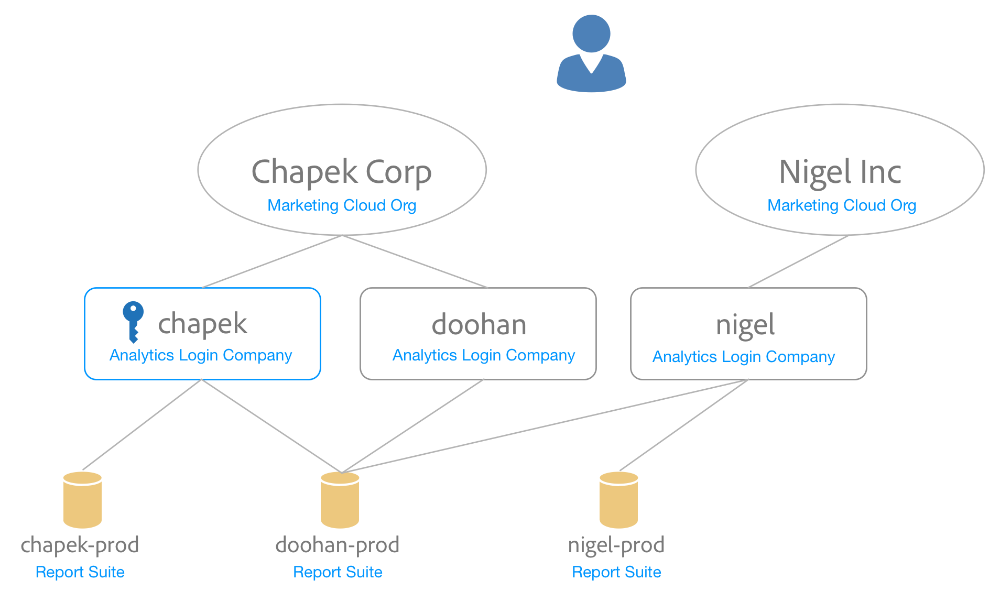

# Map report suites to an organization {#topic_7C4740559EAC4E0FA5F8DEF886B580DA}

>[!NOTE]
>
>Report Suite Mapping functionality was deprecated in November 2020. Reach out to Customer Support with any questions.

Experience Cloud services (such as Experience Cloud ID Service and [!UICONTROL People]) are associated with an organization instead of an individual report suite. To ensure that these services operate correctly, each Analytics report suite must be mapped to an organization. The mapping process: 

* Sets an Experience Cloud organization as the primary organization for the report suite.
* Does not change who can access a report suite (access is still determined by the Adobe Analytics login account for each user)

## Requirements 

You must be an Analytics administrator of a login company that has access to the report suite you want to map. Also, this account must be [linked to an Experience Cloud organization](../admin-getting-started/organizations.md#topic_C31CB834F109465A82ED57FF0563B3F1) in order to map report suites to that organization. 

Organizations are grayed out if you do not have Analytics administrator permissions for a login company under that organization that has access to the given report suite. 

## Map a report suite to an organization {#task_23993FE78DF6455FA8D7BE60686EA16C}

1. Navigate to Report Suites for Data Governance at [!DNL Analytics] > **[!UICONTROL Admin]** > **[!UICONTROL Data Governance]** (see [View/Manage Report Suite's Data Governance Setting](https://experienceleague.adobe.com/docs/analytics/admin/data-governance/gdpr-view-settings.html?lang=en)

1. To see the login companies that have access to each report suite, click **[!UICONTROL Visible to Login Companies]**.

   This view is intended to help you make an informed decision on the mapping. 

1. Click the drop-down in the **[!UICONTROL Mapped Organization]** column next to a report suite and select the organization to which you want to map.

   See the next section for tips on selecting an Experience Cloud organization.

## Map multiple report suites to an organization {#task_94955B0D8ABA4CB1A38746ECF8E32711}

1. Click **[!UICONTROL Experience Cloud]** > **[!UICONTROL Administration]** > **[!UICONTROL Report Suite Mapping]**.

1. Select the report suites that you want to map.

    

1. Select the organization (Outdoors Inc, in this example), then click **[!UICONTROL Select]**.

   See the next section for tips on selecting an Experience Cloud organization. 

1. Click **[!UICONTROL Save Mapping]**.

## Tips for Selecting an Experience Cloud Organization {#mapping-tips}

This section contains tips to help you select the Experience Cloud organization to which you should map a report suite. 

### Which organization should I choose?

If the Experience Cloud ID Service is deployed on the report suite, ensure the organization that you select in the Report Suite Mapping tool is the same organization specified in the [!DNL visitorAPI.js] file on your site. You can use the instructions in [Test and Verify the Experience Cloud ID Service](https://experienceleague.adobe.com/docs/id-service/using/implementation/test-verify.html) to find the org ID that is being used by the Visitor ID service. 

Ensure that your deployment matches the organization you chose in the Report Suite Mapping tool.  

### Why are some organizations grayed out?

Graying out an organization indicates that you do not have sufficient privileges to map to the grayed-out report suite. Consider the following example:

In this diagram, the blue key indicates admin privileges. The gray lines indicate visibility.

This user has access to two Experience Cloud organizations. They have performed the following:

* Linked their admin account in the [!UICONTROL chapek] Analytics login company to their [!UICONTROL Chapek] Corp Experience Cloud organization account.
* Linked their non-admin account in the [!UICONTROL doohan] Analytics login company to their [!UICONTROL Chapek] Corp Experience Cloud organization account.
* Linked their non-admin account in the nigel Analytics login company to their Nigel Inc Experience Cloud org account.

The following points list the mapping actions this user can and cannot perform regarding these report suites:

* [!UICONTROL Chapek-prod] report suite can be mapped to [!UICONTROL Chapek] Corp org since this user is an admin of a linked Analytics login company ([!UICONTROL chapek]) and his account is linked to this org.
* [!UICONTROL Nigel-prod] report suite cannot be linked by this user since they are not an admin in any login company to which this report suite is visible.
* [!UICONTROL Doohan-prod] report suite can be mapped to [!UICONTROL Chapek Corp] since this user is an admin of a login company ([!UICONTROL chapek]) that is linked to the Experience Cloud org (note that he is not an admin of the doohan Analytics login company). It is important to know that the [!UICONTROL doohan-prod] report suite is also eligible to be mapped to the Nigel Inc Experience Cloud org, even though this user cannot perform that mapping. In this case, both Experience Cloud organizations are displayed in the list, but [!UICONTROL Nigel Inc] is grayed out. Before mapping, this user should consult with an admin of the nigel login company to determine which org is the best candidate for mapping. The UI displays a Possible Conflict warning if you select an organization this is different from the organization under which the report suite was originally created.

## Frequently Asked Questions {#section_099E485805994C929FF9C9F75219BEE1}

### Why don’t I see all my report suites?

Some of your report suites might be visible under a different login company. You can change the current login company using the drop-down at the top of the screen.

### What if I don’t recognize some of the organizations listed in the drop-down for one of my report suites?

The list shows you all the *possible* organizations your report suite could be mapped to, even you don’t have permission to map to all those report suites. If you are unsure if the report suite should be mapped to one of the grayed-out report suites in the list, please consult with an Experience Cloud administrator in your organization to determine the best choice.

### What if I don’t recognize some of the Login Companies listed for a report suite in the “Visible to Login Companies” column?

At some point, this report suite was shared with another login company which may be part of a different Experience Cloud organization.

### What is this “Possible Conflict” error about the report suite being generated by another organization? Why does that matter?

This notification helps you make an informed decision about your report suite mapping. We want to make you aware that the report suite was originally created underneath a different organization in case that organization may be more appropriate for this report suite.

### How do I know if a report suite is mapped?

Mapped report suites are displayed in a non-editable format. If you must change a mapping, please contact Customer Care.

### What if I only know the Org ID for my Experience Cloud organization? How do I look up the name for my Org ID?

You can find your organization name in [Organizations and Account Settings](https://experienceleague.adobe.com/docs/core-services/interface/manage-users-and-products/organizations.html?lang=en).

### I see a date in the “Date Mapped” column. Who did that mapping?

You can refer to the Report Suite Change Log in the Analytics interface to check the user ID that made the change. Look for the event “Suite associated to IMS Organization”.
