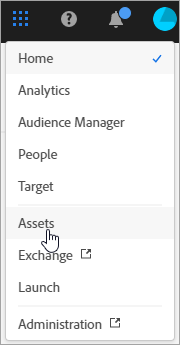
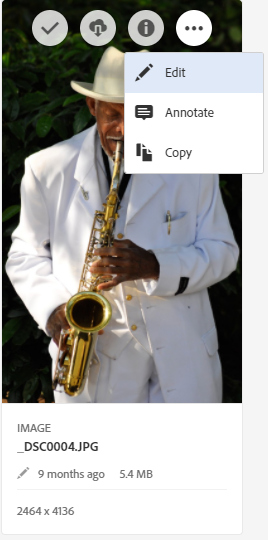
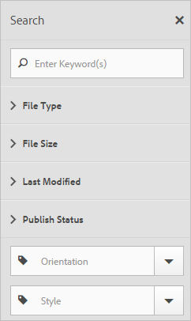
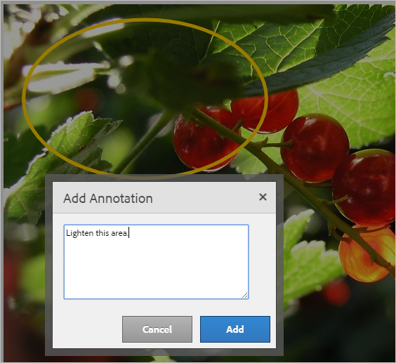
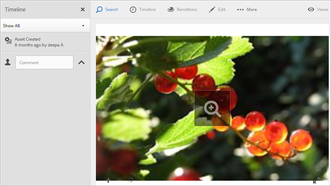
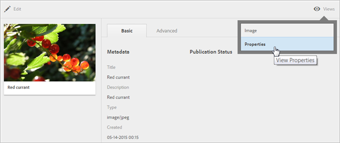
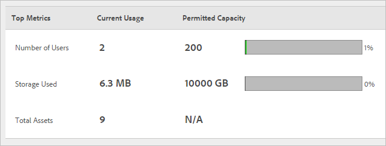

# Overview of Experience Cloud Assets

Experience Cloud Assets provide a single, centralized repository of marketing-ready assets that you can share across applications. An asset is a digital document, image, video, or audio (or part thereof) that can have multiple renditions and can have sub-assets (for example, layers in a [!DNL Photoshop] file, slides in a [!DNL PowerPoint] file, pages in a PDF, files in a ZIP).

Asset services include: 

* Asset storage, management interface, embedded selection interface (accessed through applications).
* Integrations with Creative Cloud, Experience Cloud collaboration, and Experience Cloud applications.

Using assets improves consistency and brand compliance, and speeds time to market. You can streamline workflows in applications: 

* **[!DNL Adobe Target]**: Create experiences for A/B and multivariate tests.
* **[!DNL Ad Cloud]**: Develop ad units across different channels and campaigns
* **[!DNL Adobe Campaign]**: Place assets into email newsletters and campaigns.

## Navigate to Experience Cloud Assets 

 

## Access the toolbar 

Navigate to an asset (or asset directory), then click **[!UICONTROL Select]**. 

The toolbar provides quick access to features, including Search, Timeline, Renditions, Edit, Annotate, and Download. 

 

>[!NOTE]
>
>Assets must be removed from Adobe Target activities before you can successfully delete them from [!DNL Target].

## Edit assets 

Editing an asset enables features, including: 

* Crop
* Rotate
* Flip

 

## Search for assets 

You can search by keyword, file type, size, last modified, publish status, orientation, and style. 

 

## Annotate assets 

Click **[!UICONTROL Annotate]** by drawing circles or arrows on an image, and annotate the asset for review by coworkers. 

 

## View full-screen assets, and zoom 

Click **[!UICONTROL Views]** > **[!UICONTROL Image]** to view the full asset image and enable zoom. 

 

## View asset properties 

Choose between card view with properties, list view, and column view to more easily to find your assets. 

Click **[!UICONTROL Views]** > **[!UICONTROL Properties]** to view an asset's properties: 

 

## Run usage reports 

See the number of users, storage used, and total assets. 

Click **[!UICONTROL Tools]** > **[!UICONTROL Reports]** > **[!UICONTROL Usage Report]** 

