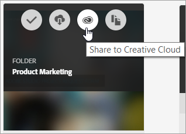
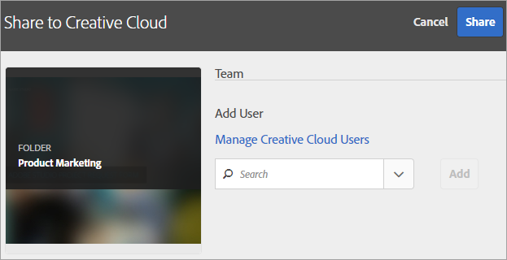
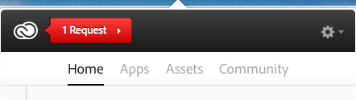
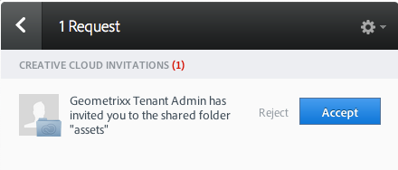
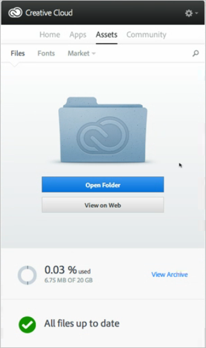
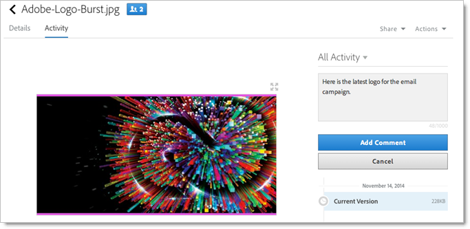
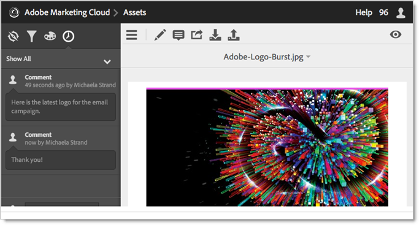
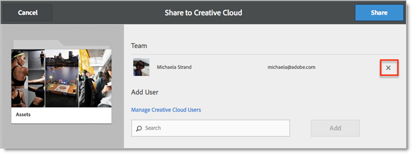
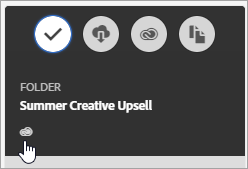

# Share a CX Enterprise asset folder

Share folders and assets between CX Enterprise and Creative Cloud. Collaborate, annotate shared assets, and use them in CX Enterprise applications like Adobe Target. The shared folder must originate from CX Enterprise. 

**Benefits of sharing**

* Streamline creative production workflows in the review, approve, and publish phase
* Spend less time managing in-process files and versions in multiple locations
* Track and manage creative assets more effectively
* Enjoy increase enterprise security
* Easily share, save, and send files between creatives and marketers

Before Creative Cloud users have access to assets, they must be allow-listed in CX Enterprise. See [Manage Creative Cloud users](manage-cc-users.md). 

**To share a CX Enterprise asset folder**

1. On an Asset folder, click **[!UICONTROL Share to Creative Cloud]**.

    
1. On the Share to Creative Cloud page, search for the user, then click **[!UICONTROL Add]**.

    

1. Click **[!UICONTROL Share]**.
1. Launch the [!DNL Creative Cloud] desktop (or navigate to the [!UICONTROL Creative Cloud Files] page in a browser) and look for the request notification.

    
1. Open the request, then click **[!UICONTROL Accept]**.

    
1. To access folder contents, click **[!UICONTROL Open Folder]** (or **[!UICONTROL View on Web]**).

    
1. Continue by adding comments on the shared asset:

   In Creative Cloud, you can select into an image, then click **[!UICONTROL Activity]** to add a comment on the image. Comments are synced on the assets in the [!DNL Creative Cloud] and [!DNL CX Enterprise]. 

    

   In CX Enterprise, select into an image, then select the time-line icon to add a comment on the image. Comments are synced on the assets in the Creative Cloud and CX Enterprise. 

    

1. To unshare a folder, click **[!UICONTROL Share Using Creative Cloud]** (similar to [Step 3](share.md)), then remove users by selecting X, then click **[!UICONTROL Share]**.

    

   Once you have removed all Creative Cloud Users, the folder is unshared and the Creative Cloud users no longer has access. 

More ways to use a shared asset include loading or swapping assets in the [Offers Library](https://experienceleague.adobe.com/docs/target/using/experiences/offers/manage-content.html) in Adobe Target for images in activities.

After you share a folder to the Creative Cloud, you will see the Creative Cloud logo on the folder. 

 

Related help:

* [Creative Cloud Help - Manage and sync files](https://helpx.adobe.com/creative-cloud/help/sync-creative-cloud-files.html)
* [Creative Cloud Help - Collaborate with others](https://helpx.adobe.com/creative-cloud/help/collaboration.html)
* [Creative Cloud Help - Collaboration FAQ](https://helpx.adobe.com/creative-cloud/help/collaboration-faq.html)

## About asset sharing with Adobe Target 

When creating activities in [!DNL Adobe Target], you can use a shared image asset when swapping images in the [!UICONTROL Offers Library].

See [Offers Library](https://experienceleague.adobe.com/docs/target/using/experiences/offers/manage-content.html) in [!DNL Target] Help.

