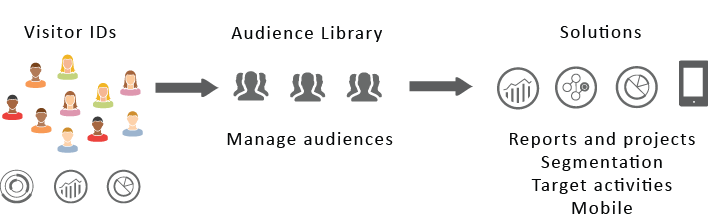

# CX Enterprise audiences 

[!DNL Audience Library] displays audiences in CX Enterprise. Audiences are collections of visitors (a list of [!DNL CX Enterprise] IDs). You can manage the translation of visitor data into audience segmentation. As such, creating and managing audiences is similar to creating and using segments. You can also share the audience segment to products and services in [!DNL CX Enterprise]. 

 

Audiences can be created or derived from various sources, such as: 

* New ones created in [!DNL CX Enterprise]
* [!DNL Analytics] segments published to [!DNL CX Enterprise]
* [!DNL Audience Manager]

**Real-Time versus historical audiences**

All audiences, regardless of where they are sourced, are accessible for real-time targeting use cases. However, audiences shared from Analytics to Audience Manager are not accessible for real-time targeting. The system evaluates audiences in two ways: 

* Historical audiences from Analytics are evaluated every four hours. Total time to process and share takes up to eight hours. Historical audiences always include return visitors.
* Real-time audiences are sourced in CX Enterprise Audiences and evaluated in real time.

## How applications use audiences 

The following table describes how audiences are used in CX Enterprise applications: 

| Solution | Description |
| --- | --- |
|CX Enterprise Audiences|Create, manage, and share audiences natively using Audience Library. You can:<ul><li>Use real-time audiences using raw analytics attributes.</li><li>Combine audiences to create composite ones, joining real-time and historical data.</li><li>See graphical views of estimated audiences size.</li></ul> For suggestions about what type of audience you want to create see [Audience creation options](https://experienceleague.adobe.com/docs/experience-cloud-kcs/kbarticles/KA-16471.html).|
|Analytics|In segmentation, you can build a segment, combine it with a report suite, and then publish the segment to CX Enterprise. Publishing the segment displays it on the [!DNL Audience Library] page in CX Enterprise. (See [Publish segments to CX Enterprise](https://experienceleague.adobe.com/docs/analytics/components/segmentation/segmentation-workflow/seg-publish.html) in [!DNL Analytics] help for details.) The audience is also available as a targeted audience for a campaign experience delivered by [!DNL Adobe Target], and in [!DNL Audience Manager]. After you share an audience from [!DNL Adobe Analytics], and select it for use in an active campaign, the visitor profiles who meet the segment definition criteria for the past 90 days are sent to [!UICONTROL Audience Services]. The limit for shared audiences has been increased to 75. Audiences shared to CX Enterprise from [!DNL Analytics] cannot exceed 20 million unique members. Also, due to caching, deleted report suites in Analytics require 12 hours before the deletion is shown in CX Enterprise.|
|Mobile Services|Analyze mobile traffic using the sunburst visualization in the [!UICONTROL Device Types] report.|
|[!DNL Target]|The [ID service](https://experienceleague.adobe.com/docs/id-service/using/home.html) unifies visitor IDs and data into a single, actionable profile for use across applications. The [!UICONTROL Publish to CX Enterprise] checkbox during the segment creation process in Adobe Analytics allows the segment to be available within the Adobe Target's custom audience library. A segment created in [!DNL Analytics] or [!DNL Audience Manager] can be used for activities in [!DNL Target]. For example, you can create campaign activities based on [!DNL Analytics] conversion metrics and audience segments created in [!DNL Analytics].|
|[!DNL Audience Manager]|Shared audiences are available in [!DNL Audience Manager] segmentation. All CX Enterprise audiences are available natively in [!DNL Audience Manager], which provides:<ul><li>Built-in automation regarding how they are shared and consumed in application workflows</li><li>Offsite destinations</li><li>Look-alike modeling</li></ul>|
|Campaign|<ul><li>Import shared audiences from different Adobe CX Enterprise applications into Adobe Campaign.</li><li>Export recipient lists in the form of shared audiences. These shared audiences can be used in the different Adobe CX Enterprise applications that you use.</li></ul>|
|Advertising Cloud|Use the audience as targets.|

{style="table-layout:auto"}

>[!IMPORTANT]
>
>Once a visitor qualifies for the audience shared from Analytics, there is a 4-8 hour delay before that information is actionable in [!DNL Target], Ad Cloud, and Campaign Standard.

## Audience Library interface elements 

[!DNL CX Enterprise] provides a library for creating and managing audiences, with native, real-time audience identification. 

**[!UICONTROL CX Enterprise]** > **[!UICONTROL Experience Platform]** > **[!UICONTROL People]** > **[!UICONTROL Audience Library]** 

 

| Element | Description |
| --- | --- |
|New|[Create an audience](https://experienceleague.adobe.com/en/docs/core-services/interface/services/audiences/create).|
|Title & Description|A column heading that identifies and describes the audience.|
|Author|The person who created the audience segment.|
|Source|Identifies where the audience was created.<ul><li>**Analytics:** A segment created in Adobe Analytics, then published to CX Enterprise.</li><li>**CX Enterprise:** A new audience [created in CX Enterprise Audiences](https://experienceleague.adobe.com/en/docs/core-services/interface/services/audiences/create).</li><li>**Audience Manager:** Audiences created Audience Manager automatically display in CX Enterprise Audiences.</li></ul>|
|Current Size|The current audience size.|
|Active|The active status of the segment.|

{style="table-layout:auto"}

## Publish audiences from Adobe Analytics

See [Publish segments to CX Enterprise](https://experienceleague.adobe.com/en/docs/analytics/components/segmentation/segmentation-workflow/seg-publish) in the Adobe Analytics documentation for more information.
