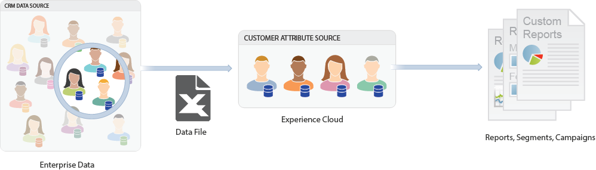

# [!DNL Customer Attributes] in CX Enterprise

**[!UICONTROL Apps]**  > **[!DNL Customer Attributes]**

[!DNL Customer Attributes] in Adobe CX Enterprise enables you to upload your captured enterprise data from a customer relationship management (CRM) database. You can [upload the data](t-crs-usecase.md) into a [!DNL Customer Attributes] data source in CX Enterprise, then use the data in [!DNL Adobe Analytics] and [!DNL Adobe Target].  

## About enterprise customer data {#customer-data}

Enterprise customer data refers to the organization-wide set of information collected about customers, prospects, and partners.It resides on other systems and can include information like memberships, loyalty level, age, gender, products owned, interests, and Lifetime Value. 

The following image is an example of a _data file_ showing subscriber data for products, including member IDs, entitled products, most-launched products, and so on.

After you create the data file, you can upload it to the customer attribute source that you create in **[!UICONTROL CX Enterprise]** > **[!UICONTROL Customer Attributes]**.

See [Upload customer attribute data](t-crs-usecase.md) to learn this workflow.

## Examples of Customer Attributes in Analytics and Target 

After the data resides in CX Enterprise, you can customize it and share it to solutions for reporting, segmentation, activities, and campaigns.

For example:

| Solution | Advantages and Use Cases |
| --- | --- |
|Adobe Analytics|Marketers and analysts can understand:<ul><li>The online campaigns that are most effective with your gold-level customers.</li><li>The products that gold-level customers search for versus products that platinum-level customers search for.</li><li>Whether your site redesign is having a positive impact on conversion rates for older customers.</li><li>The products that customers with a low lifetime value tend to research on my site.</li></ul>|
|Adobe Target|Attribute data enables Adobe Target users to:<ul><li>Show loyalty club members special discounts and offers.</li><li>Recommend more expensive products to your luxury customers.</li><li>For customers who already receive emails, show an up-sell offer in the space normally reserved for email sign-ups</li></ul>|

{style="table-layout:auto"}
