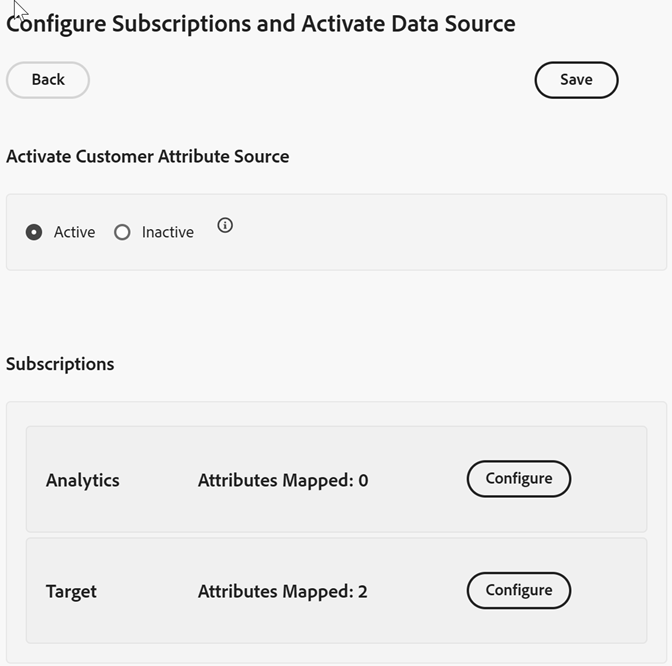

# Configure customer attribute subscriptions

[!DNL Customer Attributes] subscriptions enable the customer attribute data flow between CX Enterprise and applications ([!DNL Analytics] and [!DNL Target]).

For example, an Adobe Analytics subscription enables attribute data in reports. If you use [!DNL Adobe Target], you can upload customer attributes for targeting and segmentation. 

**To configure subscriptions and activate the data source**

1. Locate your data source in [!DNL Customer Attributes] for edit:

    In [!DNL CX Enterprise], click **[!UICONTROL Apps]**  > **[!DNL Customer Attributes]**.

1. On [!UICONTROL Edit Customer Attribute Source], click **[!UICONTROL File Upload]**. 

1. Click **[!UICONTROL Configure Subscriptions]**. 

     

1. To activate the customer attribute source, click **[!UICONTROL Active]**, then click **[!UICONTROL Save]**.

1. To configure a subscription to [!DNL Analytics] or [!DNL Target], click **[!UICONTROL Configure]**.

    The following example shows a [!DNL Target] subscription:

   

    | Element | Description |
    | --- | --- |
    |Solution|**Adobe Analytics** Select [!DNL Analytics], specify the report suites to that you want to receive attribute data, and the attributes to include. **Adobe Target** You can upload customer attributes for targeting and segmentation. This feature is useful if want to target a test based on attribute data, or make the data available for segmentation in Analytics. Uploaded customer attribute data for a visitor is available at sign in, in **[!DNL Target]** > **Audiences**. Multiple data sources are supported. When you set customer IDs on your website, verify that at least one of the aliases is subscribed to [!DNL Target].|
    |Report Suite (Adobe Analytics)|The report suites from Analytics. You cannot add more than a total of 10 report suites to the Analytics subscriptions within a single attribute source. When choosing which report suites to include, consider the following suggestions:<ul><li>Choose report suites that have a common set of authenticated customers. If the authenticated customers in one report suite do not overlap with the authenticated customers in another report suite, separate these report suites into different attribute sources.</li><li>If possible, the report suites included in an attribute source should have similar traffic volume.</li></ul> If you have more than 10 report suites that have a common set of authenticated customers, you can configure additional customer attribute sources, each with up to 10 report suites.|
    |Attributes to Include (Analytics and [!DNL Target])|The attributes that you want to send to the application.  When configuring subscriptions and selecting attributes, the following limits apply _per report suite,_ depending on the applications you own:<ul><li>Foundation: 0</li><li>Select: 3</li><li>Prime: 15</li><li>Ultimate: 200</li><li>Standard: 3 total</li><li>Premium: 200 per report suite</li><li>[!DNL Target] Standard: 5</li><li>[!DNL Target] Premium: 200</li></ul> **Note:** When you upgrade to Analytics Premium, there is a 24-hour delay before additional attributes are available. You may see an attribute Subscription Max error issued during this delay.|

1. Click **[!UICONTROL Save]**.
