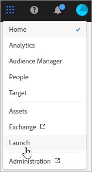

# Experience Cloud services {#topic_C1087DCC538F4F9A99D983C1BB29EBE0}

This documentation applies to features of the unified header in Experience Cloud, such as the [!DNL People] service ([!DNL Audience Library] and [!DNL Customer Attributes]), user and product management for Experience Cloud, cookies, account preferences, notifications, and so on.

To access these services in Experience Cloud, select the **[!UICONTROL Application Selector]**
.

This help describes the following products and services:

| Core Service | Description |
|--- |--- |
|[Central interface components](../experience-cloud.md)|Access account preferences, search for product help, and access applications and services.|
|[People - [!DNL Audience Library]](audiences/overview.md)|Audiences are collections of visitors (a list of visitor IDs). Adobe's [!DNL Audience Library] lets you manage the translation of visitor data into audience segmentation. As |
|[People - Customer Attributes](customer-attributes/attributes.md)| Build real-time orchestration use cases using contextual data stored in events or data sources. [!UICONTROL Journey Orchestration] is an application service integrated with the Experience Platform.|
|[Assets](assets/experience-cloud-assets.md)|Experience Cloud Assets provide a single, centralized repository of marketing-ready assets that you can share across applications.|

{style="table-layout:auto"}

>[!NOTE]
>
>Product documentation for Experience Platform is located [here](https://experienceleague.adobe.com/docs/experience-platform/landing/home.html). Technical documentation for [!UICONTROL Experience Platform] developers is found on [Adobe Developer](https://developer.adobe.com/apis).
